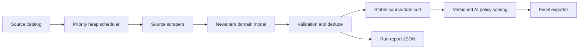

# Taiwan Government News Scraper Architecture

## Data Flow

`source_catalog.py` validates the source configuration boundary. Scrapers return
`NewsItem` domain objects. JSON and Excel dictionaries are output DTOs created only at
the reporting/export boundary.

## Module Responsibilities

- `source_catalog.py`: validated source metadata and ordering.
- `scrapers/registry.py`: lazy loading of scraper callables.
- `scheduler.py`: heap-based execution priority.
- `models.py`: domain news model with optional summary and mapping compatibility.
- `quality.py`: validation, URL normalization, and duplicate removal.
- `monitoring.py`: typed attempts, parser warnings, report schema validation.
- `excel_exporter.py`: presentation and workbook verification.
- `ai_policy_evaluation.py`: labeled-corpus precision/recall measurement.

## Data-Structure Choices And Complexity

| Structure / operation | Reason | Complexity |
| --- | --- | --- |
| `dict` source catalog | exact source lookup | average `O(1)` |
| `set` duplicate keys | one-pass duplicate detection | average `O(n)` time, `O(n)` space |
| `heap` source scheduler | deterministic risk-first priority | `O(n log n)` total |
| stable final sort | output independent from completion order | `O(n log n)` |
| typed dataclasses | constrain internal states and fields | constant-time field access |

The scheduler order and final Excel order are intentionally separate: execution order
optimizes latency, while final order optimizes reproducibility.

AI policy definitions are frozen dataclasses validated during import. Classification uses
title, optional summary, source ownership, positive terms, and negative terms to produce
per-initiative 0-100 scores plus auditable reasons. The ruleset version and deterministic
content hash are written to every run report. News records also retain date provenance, and
quality reports expose summary coverage and date-source counts.

## Error And Retry Policy

`errors.py` separates download, parse, validation, and storage failures. Only download
and underlying network/timeout failures enter the second scrape round. See
`docs/adr/0001-thread-pool-and-retry-policy.md`.

SSL fallback order is verified Requests, verified curl, then allowlisted `verify=False`.
Every insecure redirect target is checked against the allowlist before connecting.
Timezone-aware RSS timestamps are converted to `Asia/Taipei` before deriving calendar dates.
RSS collectors scan the complete returned feed rather than assuming strict reverse chronology.
