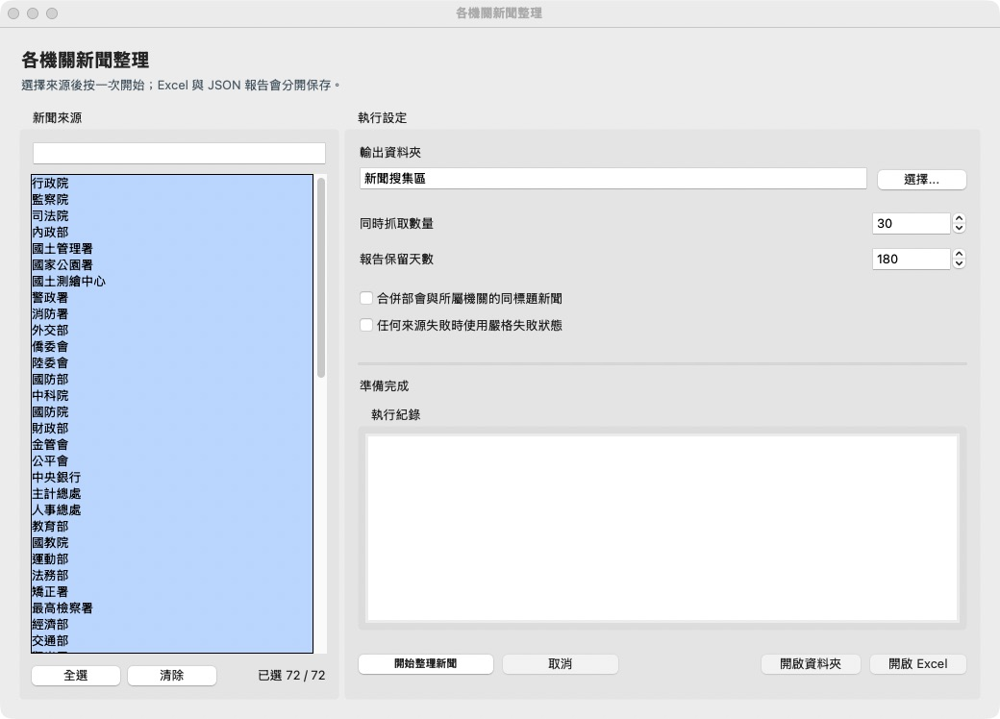
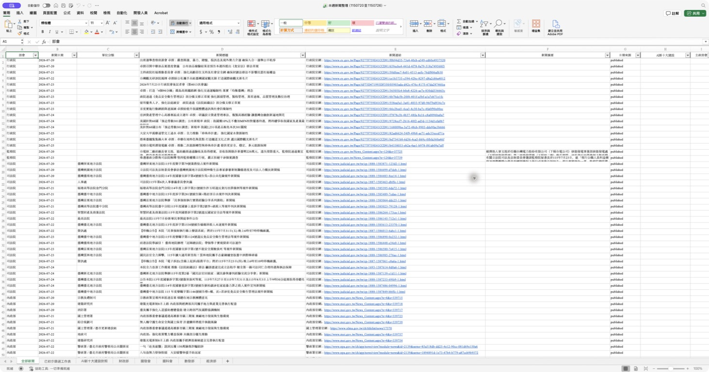

# News Scraper

[](https://github.com/ECJura2000/taiwan-government-news-scraper/actions/workflows/test.yml)
[](https://github.com/ECJura2000/taiwan-government-news-scraper/actions/workflows/build-release.yml)

中華民國政府部會每週新聞整合爬蟲，已由原本單檔程式拆分為可維護的套件結構。

目前支援 72 個政府機關與所屬單位，提供 Excel 匯出、資料品質檢查、來源健康監控、異常告警與可重現的 CI 測試。專案支援 Python 3.10、3.12 與 3.13。

## 立即下載

前往 [最新版下載頁面](https://github.com/ECJura2000/taiwan-government-news-scraper/releases/latest)，展開 `Assets`，依電腦下載對應 ZIP。一般使用者不需要下載 `source.zip`、GitHub 自動產生的 `Source code`、`SHA256SUMS.txt` 或 `SIZE-MANIFEST.txt`。

| 作業系統 | 請下載 |
| --- | --- |
| Windows 64 位元 | `taiwan-government-news-v<版本>-windows.zip` |
| macOS Apple Silicon（M1、M2、M3、M4 等） | `taiwan-government-news-v<版本>-macos-arm64.zip` |
| macOS Intel | `taiwan-government-news-v<版本>-macos-x64.zip` |
| Linux 64 位元 | `taiwan-government-news-v<版本>-linux.zip` |

下載後將整個 `各機關新聞/` 資料夾解壓縮到可寫入的位置，再開啟其中的 `各機關新聞整理`。Windows 與 macOS 首次啟動方式請見 [首次啟動說明](docs/FIRST_RUN.md)。

## 給 AI／Codex 使用的原始碼

如果只需要讓 AI、Codex 或排程啟動新聞整理，使用上表的可攜版 ZIP 即可，不必安裝 Python。

Windows：

```powershell
.\各機關新聞整理.exe --headless --json-summary
```

macOS／Linux：

```bash
./各機關新聞整理 --headless --json-summary
```

如果希望 AI 能閱讀、修改或擴充程式，請改用下列原始碼入口：

- [下載 v1.5.1 固定版本 AI 原始碼 ZIP](https://github.com/ECJura2000/taiwan-government-news-scraper/releases/download/v1.5.1/taiwan-government-news-v1.5.1-source.zip)
- [下載 main 最新原始碼 ZIP](https://github.com/ECJura2000/taiwan-government-news-scraper/archive/refs/heads/main.zip)
- 使用 Git：`git clone https://github.com/ECJura2000/taiwan-government-news-scraper.git`

對 Codex 或其他可開啟資料夾的 AI 工具，操作方式如下：

1. 下載並解壓縮原始碼 ZIP。
2. 在 AI 工具中開啟解壓後的整個專案資料夾。
3. 要求 AI「依照 `AGENTS.md` 建立環境並以 headless 模式執行」。

建議正式排程使用固定版本，避免程式在未確認的情況下自動改變。完整步驟請見 [AI／Codex 自動化指南](docs/AI_AUTOMATION.md)；專案根目錄的 [AGENTS.md](AGENTS.md) 會讓支援此格式的 AI 工具自動讀取正確執行方式。

## 畫面預覽





完整的政府資料入口、抓取方式與技術參考請見 [資料來源與參考資料](SOURCES.md)。本專案只整理各機關公開發布的新聞與公告；內容著作權、正確性與最終解釋均以原發布機關網站為準。

專題成果請見 [正式報告](PROJECT_REPORT.md)、[操作示範](docs/DEMO.md)、[UAT](docs/UAT.md)、[災難復原](docs/DISASTER_RECOVERY.md) 與 [變更紀錄](CHANGELOG.md)。

資料流、模組責任、資料結構選擇與複雜度分析請見 [架構說明](ARCHITECTURE.md)。
1 千、1 萬與 10 萬筆容量及併發量測請見 [效能基準](PERFORMANCE.md)。
新增來源、依賴更新與排程維護流程請見 [維護手冊](docs/MAINTENANCE.md)；版本規則與自動發布方式請見 [發行流程](docs/RELEASING.md)。

## 目錄

```text
news_scraper/
  main.py                 CLI 入口
  config.py               URL、排序、timeout、headers
  relevance.py            通用主題規則、設定與評分
  relevance_editor.py     主題與關鍵字 GUI 編輯器
  models.py               資料模型
  excel_exporter.py       Excel 匯出
  http/                   requests / aiohttp 共用抓取
  rss/                    RSS / feedparser 共用解析
  utils/                  日期、文字、去重工具
  scrapers/
    registry.py           全來源註冊表
    base.py               scraper 共用 helper
    ministry/
      executive/          行政院
      oversight/          監察院
      finance/            財政金融與統計相關機關
      regulators/         委員會型機關
      foreign/            外交、陸委、僑委相關機關
      culture/            文化部與故宮
      digital/            數位發展部
      economy/            經濟部
      environment/        環境部
      development/        國發會、國科會及相關行政法人
      communities/        原民會與客委會
      sports/             運動部
      interior/           內政部及所屬機關
      justice/            法務部及所屬機關
      education/          教育部及相關機關
      transport/          交通部及所屬機關
      agriculture/        農業部及所屬機關
      health/             衛福部及所屬機關
      labor/              勞動部及所屬機關
      defense/            國防部及相關機關
      oceans/             海委會及所屬機關
      veterans/           退輔會及相關機關
```

## 可攜版使用方式

Windows：

解壓 ZIP 後，直接開啟 `各機關新聞整理.exe` 使用 GUI；Codex 或排程可執行：

```powershell
.\各機關新聞整理.exe --headless --json-summary
```

Linux：

```bash
chmod +x 各機關新聞整理
./各機關新聞整理                 # GUI
./各機關新聞整理 --headless --json-summary
```

macOS Apple Silicon 與 Intel：

```bash
chmod +x 各機關新聞整理
./各機關新聞整理                 # GUI
./各機關新聞整理 --headless --json-summary
```

原始碼環境與既有 Codex automation 維持無介面執行，不需要 IDE：

```bash
.venv/bin/python -m news_scraper
```

Windows 原始碼環境使用：

```powershell
.\.venv\Scripts\python.exe -m news_scraper --headless --json-summary
```

`python -m news_scraper` 無參數時永遠執行 CLI；只有封裝檔無參數時才開啟 GUI。

執行檔目前未進行 Windows Authenticode 或 Apple Developer ID 簽章，作業系統可能顯示未知發行者警告。國土管理署來源使用 Selenium，因此即使使用單檔執行檔，環境仍須安裝 Chrome 或 Chromium。

Linux 可用下列方式核對雜湊：

```bash
sha256sum taiwan-government-news-v1.5.1-linux.zip
```

macOS 使用：

```bash
shasum -a 256 taiwan-government-news-v1.5.1-macos-arm64.zip
```

Intel Mac 請將檔名改為 `macos-x64.zip`。Windows 可用 `Get-FileHash` 計算後，與 `SHA256SUMS.txt` 的對應紀錄比對。正式 Release 單一執行檔不得超過 65 MiB，全部資產（含 AI 原始碼 ZIP）不得超過 170 MiB；Actions 中間 artifacts 只保留 1 天。

## 安裝

```bash
python3 -m pip install -r requirements.txt
```

或：

```bash
python3 -m pip install -e .
```

若要建立與目前驗證環境相同的可重現環境：

```bash
python3 -m pip install --require-hashes -r requirements.lock.txt
```

v1.5.1 已移除 pandas 與 numpy。若既有 `.venv` 曾安裝舊版依賴，單純更新不會刪除舊套件；需要重建環境才會真正回收空間：

```bash
mv .venv .venv-old
python3.12 -m venv .venv
.venv/bin/python -m pip install --require-hashes -r requirements.lock.txt
```

確認新環境可正常執行後，再自行刪除 `.venv-old`。程式不會自動刪除任何虛擬環境。

開發與測試環境：

```bash
python3 -m pip install -e ".[dev]"
```

若需要固定開發工具版本：

```bash
python3 -m pip install --require-hashes -r requirements.lock.txt
python3 -m pip install --require-hashes -r requirements-dev.lock.txt
```

完整本機品質檢查：

```bash
python3 -m ruff check .
python3 -m mypy
python3 -m compileall -q news_scraper build_entry.py
python3 -m pytest -q
```

預覽可重建暫存的可回收容量：

```bash
python3 scripts/clean_workspace.py
```

確認清單後才可執行 `python3 scripts/clean_workspace.py --apply`。清理工具不會碰 `.git`、`.venv`、新聞 Excel、JSON 執行紀錄、主題設定或憑證。

> 若你的系統沒有 `python` 指令，請把下列指令的 `python` 改成 `python3`。

## 使用方式

列出目前支援來源：

```bash
python -m news_scraper --list-sources
```

抓取全部來源：

```bash
python -m news_scraper
```

未另外指定時，Excel 會預設輸出到專案根目錄的 `新聞搜集區/`。

只抓指定來源：

```bash
python -m news_scraper --sources 財政部 法務部 衛生福利部
```

指定輸出資料夾：

```bash
python -m news_scraper --output-dir /path/to/output
```

合併部會與所屬機關重複發布的同標題新聞：

```bash
python -m news_scraper --dedupe-affiliated
```

將 JSON 執行報告輸出到指定資料夾：

```bash
python -m news_scraper --report-dir /path/to/reports
```

預設會在 Excel 輸出資料夾下的 `執行紀錄/` 產生 JSON 報告，內容包含各來源每次嘗試的耗時、筆數、錯誤分類、最終失敗來源，以及實際使用不安全 SSL 降級的主機。

設定異常 webhook：

```bash
export NEWS_SCRAPER_ALERT_WEBHOOK="https://example.com/webhook"
python -m news_scraper
```

也可以用 `--alert-webhook` 單次指定。沒有 webhook 時，每週 automation 仍會透過既有 Gmail 流程寄送 JSON 異常摘要。以下狀況會傳送告警：來源最終失敗、達到來源專屬的連續零筆門檻、執行時間異常、無效資料，或重複／非新聞內容比例突然過高。

自動化或 CI 若需要在任何來源最終失敗時回傳非零結束碼：

```bash
python -m news_scraper --fail-on-source-error
```

### 主題與關鍵字設定

GUI 的「主題與關鍵字」可自由新增、複製、改名、排序、停用或刪除分析主題，並管理核心詞、輔助詞、脈絡詞與排除詞。AI 新十大建設只是首次啟動的預設範本，不限制未來可建立的主題。

設定會保存到 `程式資料/relevance-profile.json`，GUI、headless 與既有排程會自動共用。設定視窗可匯入、匯出、加入新版範本，也能用自訂標題、摘要與發布機關立即測試分數。

指定另一份設定檔：

```bash
python -m news_scraper --relevance-profile /path/to/relevance-profile.json
```

暫時忽略已保存設定並使用內建範本：

```bash
python -m news_scraper --no-relevance-profile
```

核心詞命中標題為 85 分、摘要為 60 分。輔助詞需搭配脈絡詞或由優先關聯機關發布；全域與主題排除詞可分別檢查標題、摘要或兩者，命中後扣 50 分。同一主題命中多個排除詞仍只扣一次。

國土管理署網站是 JavaScript 動態頁，且會出現一般 `curl`/HTTP2 不易直接讀取的防護頁；程式會改用 Selenium 開啟瀏覽器取得列表。若只抓國土管理署，建議確認本機已安裝 Chrome/Chromium，並已安裝 `requirements.txt` 內的 `selenium`：

```bash
python -m news_scraper --sources 國土管理署 --max-workers 1
```

## 輸出

程式會輸出：

- 終端機表格摘要
- `本週新聞整理（民國起迄日期）.xlsx`
- 全部新聞工作表
- 通用主題初步篩選工作表，高度相關整列標示亮黃色、可能相關整列標示淺黃色
- `新聞摘要`、`日期來源`、`關聯主題`、`優先關聯機關`、`關聯性`、`關聯分數`、`判定理由`、`命中關鍵字`、`排除關鍵字`、`各主題評分` 判讀欄位
- `主題規則對照`、`關聯性規則` 與 `規則版本` 稽核工作表
- 指定重點部會分頁

關聯分數為 0 至 100 分：80 分以上為高度相關、40 至 79 分為可能相關、低於 40 分不納入初步篩選。同一新聞符合多個主題時，`各主題評分` 會保留每項自己的分數與相關性，不以單一最高分取代全部結果。設定載入時會驗證 ID、主題、機關、比對欄位、重複詞及納入／排除衝突；無效設定會明確停止執行，不會靜默改用其他規則。

預設 AI 十大建設範本仍可用 205 筆回歸語料與獨立的 2026-06-22 至 06-28 時間留存集重跑評估：

```bash
python3 scripts/evaluate_ai_policy.py
python3 scripts/evaluate_ai_policy.py tests/fixtures/ai_policy_holdout_20260622.tsv --require-published-date
```

需要稽核官方頁面是否仍包含標題時，可額外加上 `--verify-sources`。此模式需要網路，故不放入一般 CI。

## 開發說明

- `SCRAPER_REGISTRY` 位於 `news_scraper/scrapers/registry.py`
- `SOURCE_ORDER` 位於 `news_scraper/config.py`
- 共用 RSS 規則優先放在 `rss/` 與 `scrapers/base.py`
- 可重用工具函式優先放在 `utils/`
- 下級機關 scraper 盡量放在對應部會子資料夾
- `monitoring.py` 負責錯誤分類與 JSON 執行報告
- `verify=False` 僅允許用於 `config.py` 的 SSL 白名單主機，每次重新導向都會重新驗證 host，所有實際降級主機都會記錄在執行報告
- 帶時區的 RSS 日期會先轉為 `Asia/Taipei` 再取新聞日期
- RSS 不假設項目永遠按日期倒序，舊項目後方的本週新聞仍會被掃描

## 監控與告警

執行報告的 `status` 為 `success`、`attention` 或 `partial_failure`。排程系統可監控最新報告中的下列欄位：

- `failed_sources`：重試後仍失敗的來源
- `error_counts`：`timeout`、`ssl`、`http`、`connection`、`browser`、`parse`、`unexpected` 分類統計
- `insecure_ssl_hosts`：本次實際停用 SSL 驗證的白名單主機
- `source_attempts`：各來源每次嘗試的耗時、結果與錯誤摘要
- `scheduling_plan`：priority queue 的來源啟動順序、歷史失敗率、平均耗時與靜態難度
- `quality`：無效資料、重複新聞、排除的非新聞內容、摘要覆蓋率、日期來源統計及各來源最終筆數
- `anomalies`：連續零筆與耗時異常
- `parser_warnings`：日期或欄位格式已命中但解析失敗的紀錄，用來區分正常零筆與網站格式異常
- `quality.alert_reasons`：超過告警門檻的資料品質問題；少量正常清理不會觸發告警
- `relevance_policy`：本次 Excel 使用的設定名稱、schema、範本版本、有效規則雜湊及規則數量
- `ai_policy.version`、`ai_policy.ruleset_hash`：保留一個版本的舊欄位相容別名

程式依序嘗試 Requests 正常 SSL 驗證、安全 curl；兩者都失敗且主機位於白名單時，才會最後降級為 `verify=False`。不安全模式手動處理 redirect，目的 host 不在白名單時立即拒絕。這讓已修復憑證的網站可以自動恢復安全連線，並避免在安全 curl 可用時停用驗證。

執行報告預設保留 180 天，可用 `--report-retention-days` 調整。`執行紀錄/trend_summary.json` 會彙整最近 52 次報告的來源成功率、平均耗時與零筆次數。

累積至少 8 次報告後，`trend_summary.json` 的 `ssl_allowlist_audit.removal_candidates` 才會列出近期未曾使用 SSL 降級的白名單主機。移除前仍應以實際來源 smoke test 驗證，避免因低頻來源尚未執行而誤刪。

零筆告警依來源頻率分級：高頻來源通常連續 2 次、一般來源 4 次、低頻來源 8 次；農科園區因目前只出現徵才內容，暫時停用零筆告警。規則位於 `news_scraper/policy.toml`。

來源抓取使用 heap priority queue 排程。近期失敗率較高、歷史耗時較長或靜態難度較高的來源會優先啟動，讓慢速工作與其他來源併發執行；Excel 最終排序仍依固定機關順序，不受排程影響。

可用環境變數載入另一份政策檔，不必修改程式碼：

```bash
export NEWS_SCRAPER_POLICY_FILE=/path/to/policy.toml
python -m news_scraper
```

## 資料品質

匯出前會執行資料品質檢查：

- 排除缺少來源、日期、標題或網址的資料
- 排除無效日期與非 HTTP(S) 網址
- 移除追蹤參數與網址 fragment
- 移除同來源、同日期、同標題或同網址的重複資料
- 排除明確的事求人徵才內容

所有排除項目都會保留在 JSON 報告的 `quality.issues`，不會靜默遺失。

建議每次更新套件後重新執行完整測試，再以 `python3 -m pip freeze` 檢查並更新 `requirements.lock.txt`。

## 驗證

目前可用的基本檢查：

```bash
python3 -m compileall news_scraper build_entry.py
python -m news_scraper --list-sources
```

如果本機有安裝 `pytest`，也可以執行：

```bash
pytest -q
```

GitHub Actions 會在 Python 3.10、3.12 與 3.13 執行測試，並另外執行 Ruff、Mypy、Bandit、pip-audit、workflow SHA 檢查、10,000 筆 Excel 效能門檻、跨平台 PyInstaller 建置，以及 runtime、GUI、headless、browser、registry 與來源 smoke test。runtime、dev、build 與 security 鎖檔均含套件雜湊。

## 安全性與授權

本專案使用 [MIT License](LICENSE)。安全性問題請依照 [Security Policy](SECURITY.md) 私下回報，不要在公開 Issue 中張貼憑證、私人 webhook URL 或個人資料。
