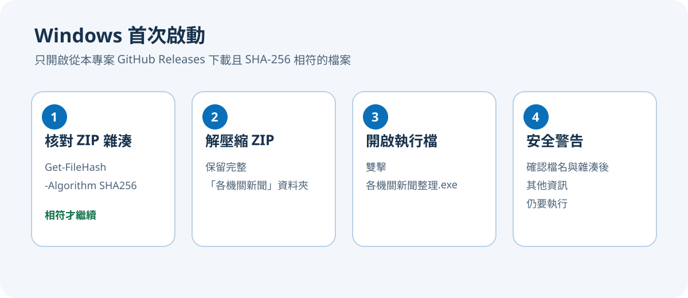
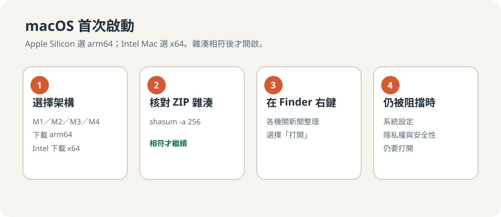

# 首次啟動說明

執行檔目前未使用 Windows Authenticode 或 Apple Developer ID 簽章。請只從本專案的 [GitHub Releases](https://github.com/ECJura2000/taiwan-government-news-scraper/releases/latest) 下載，先核對 SHA-256，再依下列方式開啟。不要對來源不明的執行檔略過安全警告。

## Windows

1. 以 PowerShell 執行 `Get-FileHash .\taiwan-government-news-v<版本>-windows.zip -Algorithm SHA256`，並與 Release 的 `SHA256SUMS.txt` 比對。
2. 雜湊相符後，解壓縮 ZIP 並保留完整的 `各機關新聞/` 資料夾。
3. 雙擊 `各機關新聞整理.exe`。
4. 若 Microsoft Defender SmartScreen 顯示未知發行者，確認下載來源與 ZIP 雜湊後選擇「其他資訊」，再選擇「仍要執行」。

## macOS

先確認處理器架構：

- Apple 選單 >「關於這台 Mac」顯示 Apple M 系列晶片：下載 `macos-arm64.zip`。
- 顯示 Intel 處理器：下載 `macos-x64.zip`。

1. 在終端機執行 `shasum -a 256 <ZIP檔名>`，並與 Release 的 `SHA256SUMS.txt` 比對。
2. 雜湊相符後，解壓縮 ZIP 並保留完整的 `各機關新聞/` 資料夾。
3. 在 Finder 對 `各機關新聞整理` 按右鍵，選擇「打開」。
4. 若仍被阻擋，前往「系統設定 > 隱私權與安全性」，確認下載來源與 ZIP 雜湊後選擇「仍要打開」。

## 共通需求

- 請將整個 `各機關新聞/` 資料夾解壓縮到桌面、文件或其他可寫入的位置。
- 國土管理署來源需要系統已安裝 Chrome 或 Chromium。
- Excel 會輸出到 `新聞搜集區/`，JSON 報告會放在 `新聞搜集區/執行紀錄/`。
- GUI 可從「主題與關鍵字」管理通用分析規則；設定保存於 `程式資料/relevance-profile.json` 並與 headless 共用。
- 中文介面使用標楷體系列，英文、數字與路徑使用 Times New Roman 系列；其他平台缺少字型時會使用相近替代字型。
